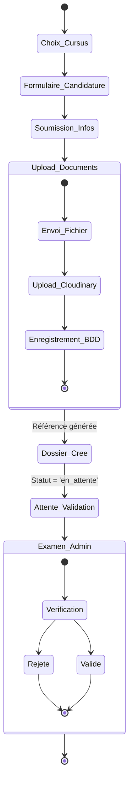
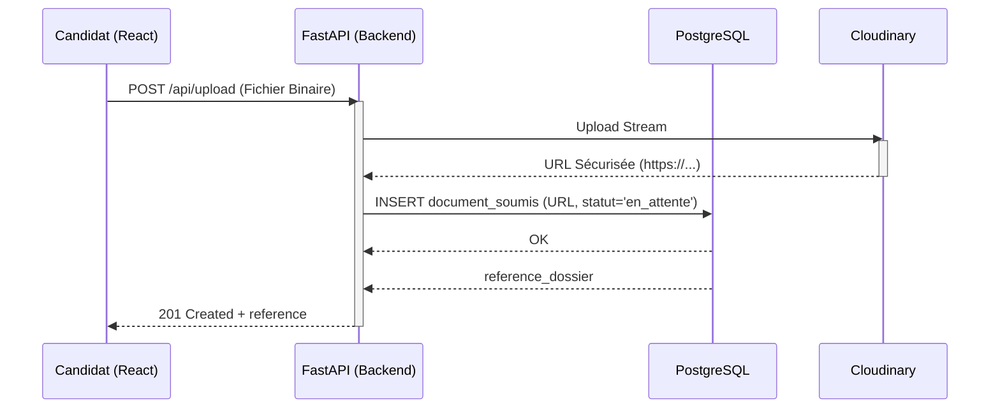
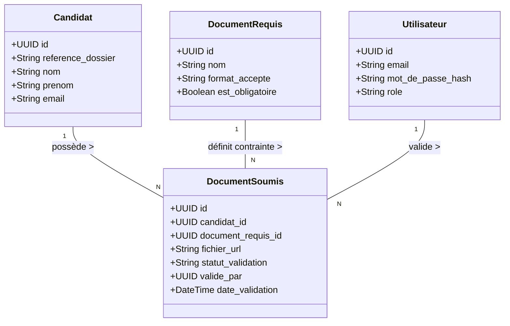
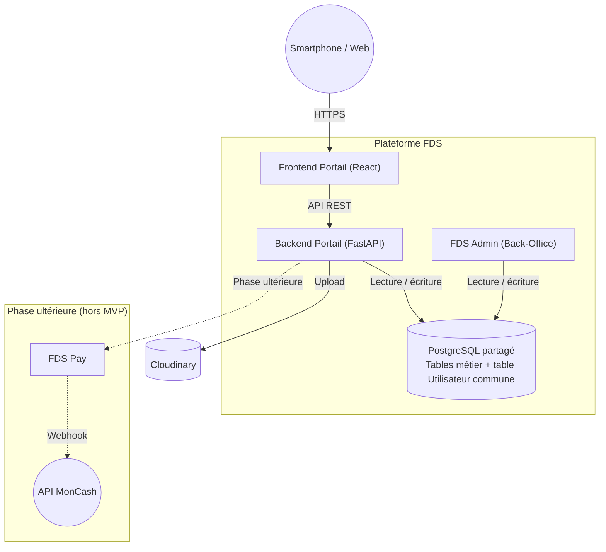

# Cahier des Charges - FDS Portail (Module 2)

> **Note d'Ingénierie :** Ce document est structuré selon la méthodologie d'Analyse et Conception. Chaque section découle logiquement de la précédente (du Problème jusqu'à l'Architecture), garantissant la cohérence absolue de la solution technique ("Start from Complexity and craft Certainty").

---

## §1. Problème Observé

La Faculté des Sciences (FDS) de l'UEH forme l'élite de l'ingénierie en Haïti. Pourtant, elle fait face à une complexité majeure dans sa relation avec les futurs étudiants :
- **Déficit d'information :** Les informations sur les cursus, les prérequis et les dates circulent via des canaux informels (WhatsApp, bouche-à-oreille). Il n'y a pas de source de vérité officielle accessible sur mobile.
- **Friction géographique :** Un candidat résidant hors de Port-au-Prince (ex: Gonaïves, Jacmel) doit obligatoirement se déplacer physiquement pour obtenir une information fiable ou déposer une fiche papier.
- **Opérations manuelles :** Le secrétariat gère des piles de dossiers physiques, générant un manque de traçabilité et une impossibilité pour le candidat de suivre l'avancement de son dossier.

## §2. Solution Proposée

Le **FDS Portail (Module 2)** est la réponse technologique à cette complexité. Il s'agit de la vitrine publique officielle de la FDS et de la plateforme dématérialisée d'inscription. La solution transforme le chaos informationnel en "Certitude" pour le candidat, qui peut désormais s'informer, postuler et suivre son dossier intégralement en ligne depuis son smartphone.

---

## §3. Argumentation (Customer Journey & Hypothèse)

### 3.1 Persona Principal
**Louismy, 17 ans**, élève en Terminale à Pétion-Ville. Il possède un smartphone Android avec une connexion 3G intermittente. Il souhaite s'inscrire en génie informatique mais ne trouve aucune information officielle sur les dates et les modalités d'admission.

### 3.2 Interviews et Verbatims
Afin de valider la réalité du terrain, une interview type a été conduite avec un profil cible. La consigne était : *"Racontez-moi votre recherche d'information pour postuler à la FDS."*

**Synthèse des réponses :**
- **Recherche initiale :** *"J'ai cherché sur Google [...] J'ai trouvé un site web ancien avec les cursus, mais pas à jour [...] Le formulaire de contact ne marchait pas."*
- **Tentative de contact :** *"J'ai trouvé l'adresse avec un numéro de téléphone [...] Je n'ai pas eu de réponse. J'ai alors compris qu'il fallait me rendre sur place."*
- **Expérience sur place :** *"On m'a donné une brochure photocopiée avec des corrections à la main [...] Je n'ai pas eu de confirmation, elle m'a dit de revenir dans 2 semaines."*

**Verbatims clés (Ce qui justifie le MVP) :**
> *"J'ai trouvé un site web ancien, pas à jour, et surtout difficilement navigable. Le formulaire de contact ne marchait pas."*
> *"Je me demandais comment une école d'ingénieur de renom comme la FDS pouvait ne pas avoir de site web à jour en 2026 avec la possibilité de faire des inscriptions en ligne. Est-ce que je faisais le bon choix ?"*

### 3.3 Customer Journey (État Actuel / As-Is)
Déduit des interviews, voici le parcours d'un candidat sans la plateforme :
1. **Recherche :** Louismy tape "FDS Haïti" sur Google. Il ne trouve rien d'officiel.
2. **Déplacement :** Il se rend physiquement à la FDS (ou à Delmas 33), ce qui est chronophage et anxiogène vu le contexte sécuritaire.
3. **Au Secrétariat :** Il reçoit une feuille photocopiée et doit revenir plus tard pour déposer son dossier physique.
*Pain Point majeur : Asymétrie d'accès à l'information et obligation de déplacement physique.*

### 3.4 Hypothèse Testable
| | |
|---|---|
| **Nous croyons que** | les lycéens, en particulier hors de Port-au-Prince, |
| **ont besoin de** | trouver les informations officielles et soumettre leur candidature en ligne depuis un téléphone, |
| **pour** | ne plus dépendre d'un déplacement physique pour s'inscrire à la FDS. |
| **Nous saurons que c'est vrai si** | au moins **20 candidatures** sont soumises via le formulaire en ligne dans les 2 premières semaines **et** au moins **70 % des candidats complètent le processus sans déplacement physique**. |

---

## §4. Priorisation MoSCoW

### 🟢 Must Have (Requis pour le MVP)
- Pages de présentation des cursus (Informatique, Physique, etc.) et dates clés.
- Formulaire de candidature en ligne avec upload de pièces justificatives (PDF/JPG).
- Génération d'un numéro de référence de dossier (ex: `CAN-2026-X`).
- Suivi du dossier (tracking) en ligne par le candidat via sa référence.
- Interface sécurisée pour l'administration (changer le statut d'un document).

### 🟡 Should Have (Important)
- Notifications automatiques par email (confirmation de réception).

### 🔴 Won't Have (Hors Scope Phase 1)
- Paiement en ligne (délégué au Module FDS Pay).
- Plateforme de cours (déléguée à FDS Akademi).

---

## §5. MVP et Walking Skeleton

### Le Walking Skeleton (Le parcours minimal de bout en bout)
> Louismy ouvre le portail FDS sur son téléphone Android. Il consulte la page du cursus Ingénierie. Il clique sur "Postuler", remplit ses informations (nom, prénom, email), et uploade une photo de son diplôme du baccalauréat. Il clique sur "Soumettre". Le système lui affiche immédiatement son numéro de référence `CAN-2026-0089`. Plus tard, Louismy saisit cette référence dans l'espace de suivi et voit que son dossier est en statut **"en attente de validation"**. L'administration voit le dossier apparaître dans son tableau de bord et met à jour son statut.

---

## §6. Use Cases et User Stories

### 6.1 Diagramme de Cas d'Utilisation
```mermaid
usecaseDiagram
    actor Candidat
    actor AdminFDS as "Admin FDS"

    rectangle "FDS Portail" {
        usecase "S'informer sur les cursus" as UC1
        usecase "Soumettre sa candidature" as UC2
        usecase "Uploader des pièces justificatives" as UC3
        usecase "Suivre l'état de son dossier" as UC4

        usecase "Se connecter au tableau de bord" as UC5
        usecase "Évaluer les dossiers" as UC6
        usecase "Valider/Rejeter un document" as UC7
    }

    Candidat --> UC1
    Candidat --> UC2
    Candidat --> UC4

    UC2 ..> UC3 : <<include>>

    AdminFDS --> UC5
    AdminFDS --> UC6

    UC6 ..> UC7 : <<include>>
```

### 6.2 User Stories (Backlog MVP)
- **US1 :** En tant que candidat, je veux consulter la liste des documents requis afin de préparer mon dossier d'admission.
- **US2 :** En tant que candidat, je veux téléverser mes fichiers (PDF/JPG) en ligne afin de ne pas avoir à les apporter physiquement au secrétariat.
- **US3 :** En tant qu'administrateur, je veux modifier le statut d'un document (`valide`, `rejete`) afin que le candidat connaisse l'état de sa demande.

---

## §7. Scénarios et Séquences (Comportement)

### 7.1 Diagramme d'Activités (Le Workflow de l'US2 et US3)
Le changement du comportement utilisateur modifie l'état des données.


### 7.2 Diagramme de Séquence (Appel API Upload)


---

## §8. Modèle de Données (Structure)

Puisque nos User Stories impliquent de lier un Candidat à des Documents, notre modèle de données reflète ce besoin (Normalisation 3NF).

**Distinction métier et table partagée**

La table `Utilisateur` est une ressource transverse partagée à l'échelle de la plateforme FDS. Elle centralise l'identité et les rôles des acteurs internes (administrateurs, agents, responsables) et permet un mécanisme de **Single Sign-On (SSO)** entre les différents modules applicatifs.

L'entité `Candidat` représente une personne qui soumet un dossier d'admission. Dans le MVP, le candidat peut soumettre un dossier sans créer de compte.

### Diagramme de Classes UML


### 8.1 Contraintes métier
- Chaque dossier possède une référence unique.
- Un candidat ne peut avoir qu'un dossier actif par campagne d'admission.
- Les formats autorisés sont PDF, JPG et JPEG.
- La taille maximale d'un fichier est fixée à 5 Mo.
- Le backend vérifie le type MIME réel avant enregistrement.
- Un document rejeté peut être remplacé par le candidat.

---

## §9. Architecture et Composants

Le modèle de données et les séquences s'exécutent au sein d'une architecture orientée services (SOA) où **FDS Portail** interagit avec le reste de la Plateforme FDS.

### Diagramme de Composants


### Justification Technologique (Stack)
- **Frontend :** React 19 / Vite. Navigation côté client (SPA) pour garantir une expérience fluide (Mobile-First) essentielle pour les utilisateurs en 3G (découlant du Persona).
- **Backend :** FastAPI (Python). Performance asynchrone pour ne pas bloquer le serveur lors de l'upload des pièces justificatives vers Cloudinary.
- **Base de données :** PostgreSQL. Garantit l'intégrité référentielle stricte (ACID) entre les Candidats et leurs Documents.
- **SSO (Single Sign-On) :** L'authentification des administrateurs se fait via des jetons JWT validés contre la table partagée `Utilisateurs`, liant ainsi les frontières entre FDS Portail et FDS Admin.

### Sécurité applicative

Le portail applique plusieurs mécanismes de sécurité afin de protéger les données des candidats et l’intégrité du système.

- **Validation des fichiers uploadés :** seuls les formats PDF, JPG et JPEG sont acceptés.
- **Contrôle du type MIME réel :** le backend vérifie le type effectif du fichier et ne se fie pas uniquement à l’extension.
- **Limitation de taille :** chaque fichier est limité à **5 Mo**.
- **Stockage indirect :** les fichiers ne sont pas exposés directement depuis le serveur applicatif ; ils sont stockés via un service externe avec URL sécurisée.
- **Références de dossier uniques :** chaque soumission reçoit une référence unique afin d’éviter toute ambiguïté de suivi.
- **Contrôle d’accès administrateur :** seuls les utilisateurs authentifiés disposant du rôle approprié peuvent accéder au back-office.
- **Authentification centralisée :** l’accès des administrateurs repose sur des jetons JWT validés à partir de la table partagée `Utilisateur`.
- **Validation côté backend :** toutes les règles métier critiques sont vérifiées côté serveur, indépendamment des contrôles frontend.
