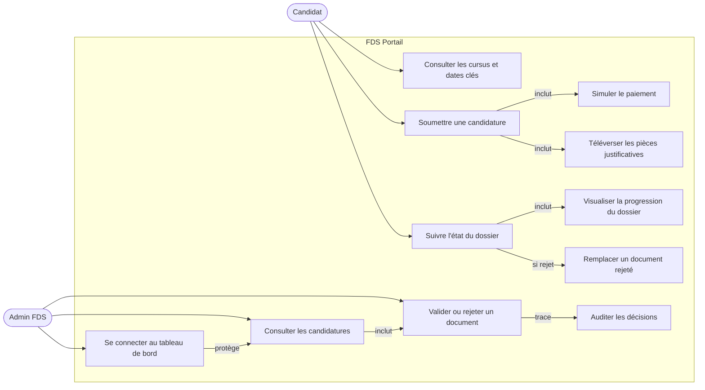
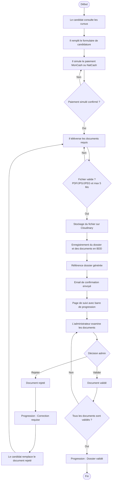
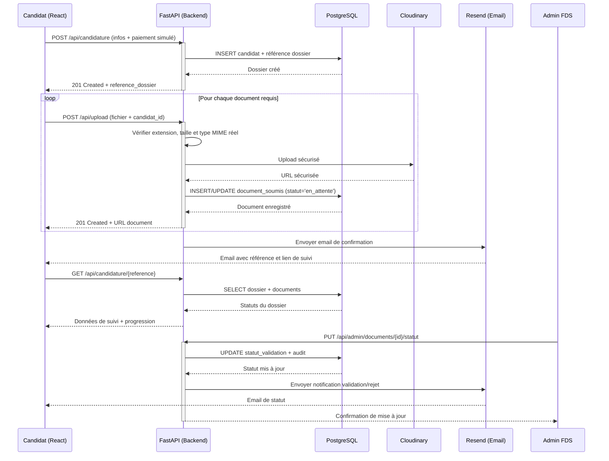
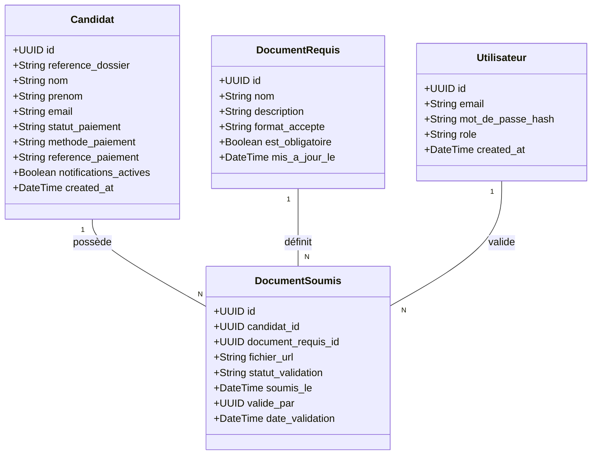
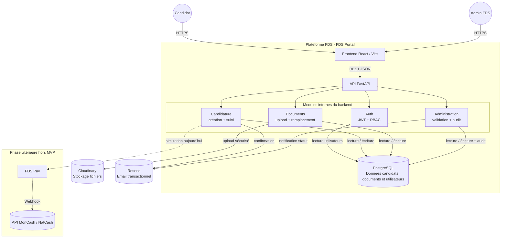

# Cahier des Charges - FDS Portail (Module 2)

> **Note d'Ingénierie :** Ce document est structuré selon la méthodologie d'Analyse et Conception. Chaque section découle logiquement de la précédente (du Problème jusqu'à l'Architecture), garantissant la cohérence absolue de la solution technique ("Start from Complexity and craft Certainty").

---

## §1. Problème Observé

La Faculté des Sciences (FDS) de l'UEH forme l'élite de l'ingénierie en Haïti. Pourtant, elle fait face à une complexité majeure dans sa relation avec les futurs étudiants :
- **Déficit d'information :** Les informations sur les cursus, les prérequis et les dates circulent via des canaux informels (WhatsApp, bouche-à-oreille). Il n'y a pas de source de vérité officielle accessible sur mobile.
- **Friction géographique :** Un candidat résidant hors de Port-au-Prince (ex: Gonaïves, Jacmel) doit obligatoirement se déplacer physiquement pour obtenir une information fiable ou déposer une fiche papier.
- **Opérations manuelles :** Le secrétariat gère des piles de dossiers physiques, générant un manque de traçabilité et une impossibilité pour le candidat de suivre l'avancement de son dossier.

## §2. Solution Proposée

Le **FDS Portail (Module 2)** est la réponse technologique à cette complexité. Il s'agit de la vitrine publique officielle de la FDS et de la plateforme dématérialisée d'inscription. La solution transforme le chaos informationnel en "Certitude" pour le candidat, qui peut désormais s'informer, postuler et suivre son dossier intégralement en ligne depuis son smartphone.

---

## §3. Argumentation (Customer Journey & Hypothèse)

### 3.1 Persona Principal
**Louismy, 17 ans**, élève en Terminale à Pétion-Ville. Il possède un smartphone Android avec une connexion 3G intermittente. Il souhaite s'inscrire en génie informatique mais ne trouve aucune information officielle sur les dates et les modalités d'admission.

### 3.2 Interviews et Verbatims

Afin de valider la réalité du terrain, une interview a été conduite avec un profil cible correspondant au persona. La consigne d'ouverture était : *« Racontez-moi ce que vous avez fait pour trouver les informations sur la FDS et comprendre comment postuler. Depuis le moment où vous avez décidé de vous y intéresser jusqu'au moment où vous avez soumis votre candidature ou renoncé. »*

---

**Q1. Première recherche :** *« Quand vous avez décidé de vous renseigner sur la FDS pour vous y inscrire, qu'est-ce que vous avez fait en premier ? Racontez-moi. »*

> « J'ai cherché sur Google. J'ai tapé 'FDS Haïti'. J'ai trouvé une site web ancien avec les cursus, mais pas à jour de ce que je ressentais, et surtout difficilement navigable. Le formulaire de contact ne marchait pas et je n'avais pas un numéro de téléphone direct. »

---

**Q2. Alternative :** *« Qu'avez-vous fait alors ? »*

> « J'ai eu le reflexe de chercher à nouveau en mettant 'FDS Haïti adresse' et c'est là que j'ai trouvé l'adresse de la faculté avec un numero de telephone. J'ai composé le numero et je n'ai pas eu de reponse. J'ai alors compris qu'il fallait me rendre sur place. Ce que j'ai fait 2 jours plus tard. »

---

**Q3. Déplacement :** *« Comment s'est passé votre déplacement pour aller à la FDS ? Qu'avez-vous ressenti ? »*

> « Comme tout déplacement de nos jours c'est toujours avec de l'apprehension à cause de l'insécurité. Mais comme la FDS est actuellement à Delmas 33 c'etait plus facile pour moi qui habite à Pétion-Ville. Je n'ose imaginer pour ceux qui habitent en province. Quand à mon ressenti, je me demandais comment une ecole d'ingenieur de renom comme la FDS pouvait ne pas avoir de site web à jour en 2026 avec la possibilité de faire des inscriptions en ligne. Est-ce que je faisais le bon choix ? »

---

**Q4. Informations sur place :** *« Une fois sur place, comment vous avez eu les informations dont vous aviez besoin ? »*

> « Une fois sur place, je me suis renseigné auprès des étudiants qui m'ont orienté vers le secrétariat. Là, on m'a donné une brochure photocopiée avec des corrections à la main. C'est là que j'ai eu quelque chose de concret. J'ai pu posé des questions sur les modalités d'inscription et les matières enseignées. Je n'ai pas eu de confirmation de la part du secrétariat car le calendrier n'etait pas encore sorti. Elle m'a dit de revenir dans 2 semaines ou d'appeler. »

---

**Q5. Candidature :** *« Avez-vous pu finalement vous inscrire ? Comment ça s'est passé ? Vous avez eu une confirmation ? »*

> « En effet je suis revenue quelques semaines plus tard. J'ai rempli un formulaire papier sur place. Et on m'a confirmé que j'étais admissible en me donnant un numero d'inscription et la date du concours. N'avais plus qu'à attendre le jour du concours. »

---

**Q6. Comment changer la donne :** *« Qu'est-ce qui devrait changer pour que votre expérience soit meilleure ? »*

> « Je dirai déjà d'avoir un site web à jour avec les informations sur les cursus, les prérequis, les dates et les frais. Ensuite la possibilité de postuler en ligne car cela economise un déplacement et du temps. »

---

**Verbatims clés retenus pour justifier le MVP :**

> *« J'ai trouvé une site web ancien avec les cursus, mais pas à jour de ce que je ressentais, et surtout difficilement navigable. Le formulaire de contact ne marchait pas et je n'avais pas un numéro de téléphone direct. »*

> *« Je me demandais comment une ecole d'ingenieur de renom comme la FDS pouvait ne pas avoir de site web à jour en 2026 avec la possibilité de faire des inscriptions en ligne. Est-ce que je faisais le bon choix ? »*

### 3.3 Customer Journey (État Actuel / As-Is)
Déduit des interviews, voici le parcours d'un candidat sans la plateforme :
1. **Recherche :** Louismy tape "FDS Haïti" sur Google. Il ne trouve rien d'officiel.
2. **Déplacement :** Il se rend physiquement à la FDS (ou à Delmas 33), ce qui est chronophage et anxiogène vu le contexte sécuritaire.
3. **Au Secrétariat :** Il reçoit une feuille photocopiée et doit revenir plus tard pour déposer son dossier physique.
*Pain Point majeur : Asymétrie d'accès à l'information et obligation de déplacement physique.*

### 3.4 Hypothèse Testable
| | |
|---|---|
| **Nous croyons que** | les lycéens, en particulier hors de Port-au-Prince, |
| **ont besoin de** | trouver les informations officielles et soumettre leur candidature en ligne depuis un téléphone, |
| **pour** | ne plus dépendre d'un déplacement physique pour s'inscrire à la FDS. |
| **Nous saurons que c'est vrai si** | au moins **20 candidatures** sont soumises via le formulaire en ligne dans les 2 premières semaines **et** au moins **70 % des candidats complètent le processus sans déplacement physique**. |

### 3.5 Plan de mesure de l'hypothèse

L'hypothèse sera évaluée à partir d'indicateurs simples, observables et reliés directement au parcours candidat :

| Indicateur | Méthode de collecte | Seuil de validation |
|---|---|---|
| Nombre de candidatures soumises | Comptage des dossiers créés en base (`candidats.reference_dossier`) | ≥ 20 dossiers en 14 jours |
| Taux de complétion sans déplacement | Question obligatoire à la fin du formulaire : "Avez-vous dû vous déplacer pour compléter cette candidature ?" | ≥ 70 % répondent "Non" |
| Taux d'abandon du formulaire | Comparaison entre candidats ayant commencé le formulaire et dossiers soumis | ≤ 30 % d'abandon |
| Temps moyen de soumission | Horodatage début/fin du parcours de candidature | ≤ 20 minutes sur mobile |
| Taux de documents rejetés puis remplacés | Suivi des documents passés de `rejete` à `en_attente` après remplacement | ≥ 80 % des rejets corrigés en ligne |

Ces métriques permettent d'éviter une validation subjective du MVP : le succès n'est pas seulement "le site fonctionne", mais "le site réduit effectivement la dépendance au déplacement physique".

---

## §4. Priorisation MoSCoW

### 🟢 Must Have (Requis pour le MVP)
- Pages de présentation des cursus (Informatique, Physique, etc.) et dates clés.
- Formulaire de candidature en ligne avec upload de pièces justificatives (PDF/JPG).
- Génération d'un numéro de référence de dossier (ex: `CAN-2026-X`).
- Suivi du dossier (tracking) en ligne par le candidat via sa référence.
- Interface sécurisée pour l'administration (changer le statut d'un document).
- **Notifications automatiques par email** au candidat :
  - Confirmation de réception après soumission (avec la référence `CAN-2026-X`).
  - Notification de validation d'un document par l'administration.
  - Notification de rejet d'un document (avec lien pour le remplacer).
- Possibilité pour le candidat de **remplacer un document rejeté** depuis la page de suivi.
- **Simulation du paiement des frais** (MonCash / NatCash) avec génération d'une référence transactionnelle pour préparer l'interconnexion future avec le module FDS Pay.

### 🟡 Should Have (Important)
- Notifications push (SMS) en complément de l'email.

### 🔴 Won't Have (Hors Scope Phase 1)
- Transactions monétaires réelles (L'argent réel est délégué au Module FDS Pay, seule l'UX et la persistance de simulation sont dans ce MVP).
- Plateforme de cours (déléguée à FDS Akademi).

---

### 4.1 Exigences non fonctionnelles du MVP

| Qualité attendue | Exigence mesurable | Justification métier |
|---|---|---|
| **Mobile-first** | Toutes les pages critiques doivent être utilisables sur écran 360 px de large | Le persona utilise principalement un smartphone Android |
| **Performance 3G** | Les pages publiques essentielles doivent charger en moins de 3 secondes sur connexion lente simulée | L'accès réseau est intermittent pour une partie des candidats |
| **Disponibilité** | Le portail doit rester accessible pendant la période d'inscription, avec une cible de 99 % hors maintenance annoncée | Une indisponibilité bloque directement les candidatures |
| **Accessibilité** | Les formulaires doivent respecter les principes WCAG 2.1 AA : labels, contraste, navigation clavier, messages d'erreur explicites | Le service est public et doit rester inclusif |
| **Sécurité des fichiers** | Aucun fichier > 5 Mo ni format hors PDF/JPG/JPEG ne doit être accepté côté serveur | Les documents contiennent des données personnelles |
| **Traçabilité** | Toute validation/rejet admin doit enregistrer l'administrateur, la date et le nouveau statut | Le secrétariat doit pouvoir justifier les décisions |
| **Résilience email** | Une erreur d'envoi email ne doit pas annuler la candidature ou la validation du document | L'email est une notification, pas la source de vérité |

---

## §5. MVP et Walking Skeleton

### Le Walking Skeleton (Le parcours minimal de bout en bout)
> Louismy ouvre le portail FDS sur son téléphone Android. Il consulte la page du cursus Ingénierie. Il clique sur "Postuler", remplit ses informations (nom, prénom, email), et uploade une photo de son diplôme du baccalauréat. Il clique sur "Soumettre". Le système lui affiche immédiatement son numéro de référence `CAN-2026-0089` **et lui envoie un email de confirmation** contenant ce même numéro et un lien vers la page de suivi. Plus tard, Louismy saisit cette référence dans l'espace de suivi et voit une **barre de progression** indiquant que son dossier est reçu et **"en attente de validation"**. L'administration voit le dossier apparaître dans son tableau de bord, valide ou rejette un document — **Louismy reçoit immédiatement un email** lui indiquant le statut. Si un document est rejeté, la progression affiche **"Correction requise"** et il peut remplacer le document directement depuis la page de suivi.

---

## §6. Use Cases et User Stories

### Conventions de lecture des diagrammes

Les diagrammes utilisent Mermaid afin de rester directement lisibles dans le document Markdown. Les flèches pleines représentent une action ou une dépendance directe ; les flèches annotées précisent la nature de la relation (`inclut`, `protège`, `trace`, etc.). Chaque diagramme est suivi d'une courte lecture pour expliquer son rôle dans le cahier des charges.

### 6.1 Diagramme de Cas d'Utilisation

Ce diagramme présente les interactions principales entre les deux acteurs du MVP : le **candidat**, qui utilise le portail public, et l'**administrateur FDS**, qui traite les dossiers reçus. Il permet de vérifier que chaque fonctionnalité prioritaire du MVP est reliée à un acteur et à un besoin métier.



**Lecture du diagramme :** le candidat n'a pas besoin de compte pour postuler ; il utilise sa référence pour suivre son dossier. L'administrateur, lui, doit obligatoirement passer par l'authentification avant d'accéder aux dossiers et de prendre une décision.

### 6.2 User Stories (Backlog MVP)
- **US1 :** En tant que candidat, je veux consulter la liste des documents requis afin de préparer mon dossier d'admission.
- **US2 :** En tant que candidat, je veux téléverser mes fichiers (PDF/JPG) en ligne afin de ne pas avoir à les apporter physiquement au secrétariat.
- **US3 :** En tant qu'administrateur, je veux modifier le statut d'un document (`valide`, `rejete`) afin que le candidat connaisse l'état de sa demande.
- **US4 :** En tant que candidat, je veux recevoir un email de confirmation après soumission afin d'avoir une trace officielle de mon dossier.
- **US5 :** En tant que candidat, je veux être notifié par email lorsqu'un document est validé ou rejeté afin de réagir rapidement.
- **US6 :** En tant que candidat, je veux pouvoir remplacer un document rejeté depuis la page de suivi afin de corriger mon dossier sans me déplacer.
- **US7 :** En tant que candidat, je veux simuler le paiement de mes frais via MonCash ou NatCash afin de finaliser mon inscription avant de téléverser mes documents.
- **US8 :** En tant que candidat, je veux visualiser l'avancement de mon dossier sous forme de barre de progression afin de comprendre rapidement les étapes complétées et les actions restantes.

### 6.3 User Stories Sécurité

Ces stories traduisent les exigences de sécurité en besoins compréhensibles par les acteurs du système. Elles complètent les user stories fonctionnelles et permettent de vérifier que la protection des données n'est pas seulement un détail technique.

- **US-S1 :** En tant qu'administrateur, je veux devoir m'authentifier avant d'accéder au tableau de bord afin d'empêcher l'accès non autorisé aux dossiers des candidats.
- **US-S2 :** En tant qu'administrateur autorisé, je veux que mes actions de validation ou de rejet soient enregistrées avec mon identité et la date afin d'assurer la traçabilité des décisions.
- **US-S3 :** En tant que candidat, je veux que mes documents soient accessibles uniquement aux administrateurs autorisés afin de protéger mes données personnelles.
- **US-S4 :** En tant que système, je veux refuser les fichiers dangereux, trop volumineux ou dans un format non autorisé afin de prévenir les uploads malveillants.
- **US-S5 :** En tant que responsable de la plateforme, je veux que les tentatives de connexion échouées soient limitées afin de réduire le risque d'attaque par force brute.
- **US-S6 :** En tant que responsable de la plateforme, je veux que les secrets applicatifs restent hors du code source afin d'éviter l'exposition des clés d'API, tokens et mots de passe.
- **US-S7 :** En tant que système, je veux retourner des messages d'erreur contrôlés afin de ne pas exposer les détails internes de l'application.

### 6.4 Critères d'acceptation

| Story | Critères d'acceptation |
|---|---|
| **US1** | La liste des documents requis est visible avant le formulaire ; chaque document affiche son nom, son format accepté et son caractère obligatoire. |
| **US2** | Le candidat peut téléverser un fichier PDF/JPG/JPEG ; le serveur rejette les autres formats ; le serveur rejette tout fichier supérieur à 5 Mo ; un document déjà soumis peut être remplacé sans créer de doublon. |
| **US3** | Un administrateur authentifié peut passer un document à `valide` ou `rejete` ; le système enregistre `valide_par` et `date_validation` ; un utilisateur non authentifié ne peut pas accéder à cette action. |
| **US4** | Après création d'un dossier, le candidat voit immédiatement sa référence ; si les notifications sont actives, un email de confirmation est envoyé ; si l'email échoue, le dossier reste créé. |
| **US5** | À chaque validation ou rejet, le candidat reçoit un email contenant la référence du dossier et le nom du document concerné ; le rejet inclut un lien ou une indication claire pour remplacer le document. |
| **US6** | Depuis la page de suivi, seuls les documents rejetés proposent l'action de remplacement ; après remplacement, le statut repasse à `en_attente`. |
| **US7** | Le paiement simulé permet de choisir MonCash ou NatCash ; une référence transactionnelle est générée ; cette référence est visible dans le tableau de bord admin. |
| **US8** | La page de suivi affiche une barre de progression basée sur le paiement et les statuts des documents ; si tous les documents sont validés, le dossier apparaît comme validé ; si au moins un document est rejeté, l'étape "Correction requise" est mise en évidence. |
| **US-S1** | Toute route admin nécessite un JWT valide ; un utilisateur non authentifié reçoit 401/403 ; aucun dossier candidat n'est retourné sans authentification. |
| **US-S2** | Chaque changement de statut renseigne `valide_par` et `date_validation` ; ces informations restent conservées en base pour audit. |
| **US-S3** | Les URLs ou contenus des documents ne sont jamais exposés dans une page publique ; l'accès aux documents passe par une route protégée admin. |
| **US-S4** | Le serveur vérifie l'extension, la taille et le type MIME réel ; les fichiers non conformes sont rejetés avant stockage. |
| **US-S5** | Après plusieurs tentatives échouées, la connexion admin est temporairement bloquée ou ralentie ; les messages d'erreur ne révèlent pas si l'email existe. |
| **US-S6** | Les clés Cloudinary, Resend, JWT et base de données sont lues depuis l'environnement ; aucune clé secrète n'est versionnée dans Git. |
| **US-S7** | Les erreurs retournées au client restent génériques ; les détails techniques sont conservés côté logs serveur uniquement. |

### 6.5 Matrice de traçabilité MVP

| Besoin métier | Fonctionnalité | Donnée/API concernée | Preuve attendue |
|---|---|---|---|
| Réduire le déplacement physique | Candidature en ligne + upload | `POST /api/candidature`, `POST /api/upload` | Dossier complet créé sans dépôt papier |
| Donner une source officielle | Pages cursus + documents requis | `GET /api/documents-requis` + catalogue cursus | Informations visibles avant candidature |
| Rassurer le candidat | Référence dossier + email | `reference_dossier`, service email | Référence affichée et envoyée |
| Rendre le suivi compréhensible | Barre de progression du dossier | `statut_paiement`, `statut_validation` | Étapes affichées selon l'état réel du dossier |
| Donner de la traçabilité au secrétariat | Tableau admin + audit validation | `valide_par`, `date_validation`, `statut_validation` | Décision admin historisée |
| Corriger sans revenir sur place | Remplacement d'un document rejeté | Upsert `DocumentSoumis` | Nouveau fichier en attente de validation |
| Protéger les données personnelles | Auth admin + contrôle d'accès documents | JWT, `GET /api/admin/proxy-document` | Aucun document visible sans authentification |
| Réduire les attaques applicatives | Validation fichiers + rate limiting | `POST /api/upload`, `POST /api/auth/token` | Fichiers dangereux rejetés et brute-force limité |

---

## §7. Scénarios et Séquences (Comportement)

### 7.1 Diagramme d'Activités (Parcours de candidature et suivi)

Ce diagramme décrit le parcours de bout en bout, depuis la consultation du portail jusqu'à la validation du dossier. Il met en évidence les décisions importantes : paiement simulé, contrôle des fichiers, validation administrative et remplacement d'un document rejeté.



**Lecture du diagramme :** la barre de progression n'est pas une simple décoration d'interface. Elle reflète l'état réel du dossier : paiement simulé, documents reçus, vérification, correction requise ou dossier validé.

### 7.2 Diagramme de Séquence (Soumission, upload et notification)

Ce diagramme précise la collaboration technique entre le frontend React, le backend FastAPI, la base de données, Cloudinary et Resend. Il montre aussi que les emails sont déclenchés par des événements métier, sans devenir la source de vérité du dossier.



**Lecture du diagramme :** la confirmation du dossier et la notification de statut sont asynchrones du point de vue métier : si l'email échoue, le dossier et ses statuts restent enregistrés en base de données.

---

## §8. Modèle de Données (Structure)

Puisque nos User Stories impliquent de lier un Candidat à des Documents, notre modèle de données reflète ce besoin (Normalisation 3NF).

**Distinction métier et table partagée**

La table `Utilisateur` est une ressource transverse partagée à l'échelle de la plateforme FDS. Elle centralise l'identité et les rôles des acteurs internes (administrateurs, agents, responsables) et permet un mécanisme de **Single Sign-On (SSO)** entre les différents modules applicatifs.

L'entité `Candidat` représente une personne qui soumet un dossier d'admission. Dans le MVP, le candidat peut soumettre un dossier sans créer de compte.

### 8.1 Diagramme de Classes UML

Le diagramme ci-dessous représente les entités persistantes nécessaires au MVP. Il distingue les **candidats**, qui peuvent postuler sans compte, des **utilisateurs administratifs**, qui doivent s'authentifier pour traiter les dossiers.



**Lecture du diagramme :** `DocumentSoumis` est l'entité centrale du suivi. Son `statut_validation` alimente la barre de progression côté candidat, tandis que `valide_par` et `date_validation` assurent la traçabilité côté administration.

### 8.2 Contraintes métier
- Chaque dossier possède une référence unique.
- Un candidat ne peut avoir qu'un dossier actif par campagne d'admission.
- Les formats autorisés sont PDF, JPG et JPEG.
- La taille maximale d'un fichier est fixée à 5 Mo.
- Le backend vérifie le type MIME réel avant enregistrement.
- L'admission nécessite la validation préalable d'une étape de paiement simulé (statut et référence enregistrés en BDD).
- Un document remplacé conserve le même couple logique `(candidat_id, document_requis_id)` afin d'éviter les doublons dans le dossier.
- Le statut d'un document remplacé repasse automatiquement à `en_attente`.
- Les décisions administratives doivent toujours être auditables (`valide_par`, `date_validation`).

---

## §9. Architecture et Composants

Le modèle de données et les séquences s'exécutent au sein d'une **architecture 3-tiers (Déploiement)** combinée au **pattern MVC (Organisation du code)** — deux niveaux d'abstraction complémentaires qui coexistent dans la même application.

### 9.1 Pattern Architectural : Monolithe Modulaire

Conformément à la recommandation pour les équipes de taille réduite (3–10 développeurs) et à la phase MVP du projet, FDS Portail adopte un **Monolithe Modulaire** :
- **Déploiement unique** (1 artefact — frontend + backend séparés mais coordonnés).
- **Modules internes découplés** : le code backend est organisé en modules (`candidature`, `documents`, `admin`, `auth`) aux frontières strictement définies — aucun couplage direct entre modules.
- **Base de données partagée PostgreSQL** : cohérence ACID garantie.
- **Migration future possible** vers Microservices si le domaine le justifie (sans refactoring majeur grâce aux frontières modulaires).

> **Note d'implémentation MVP :** le découpage modulaire est d'abord logique : les responsabilités sont séparées par domaine fonctionnel (authentification, candidature, documents, administration), même si certaines routes peuvent être regroupées dans un même point d'entrée FastAPI pendant la phase de prototype. La cible post-MVP est d'extraire ces responsabilités en routeurs FastAPI distincts (`routers/auth.py`, `routers/candidatures.py`, `routers/documents.py`, `routers/admin.py`) sans changer le contrat REST.

> **Pourquoi pas les Microservices ?** L'équipe est < 5 personnes, le domaine métier est en cours de définition (MVP), et la complexité opérationnelle (tracing distribué, latence réseau) n'est pas justifiée à ce stade.

### 9.2 Style d'API : REST (Contract-First)

FDS Portail expose une **API REST stateless** via FastAPI :

| Méthode HTTP | Action | Exemple endpoint |
|---|---|---|
| `GET` | Lire une ressource (idempotent) | `GET /api/candidature/{ref}` |
| `POST` | Créer une ressource | `POST /api/candidature` |
| `PUT` | Remplacer (idempotent) | `PUT /api/admin/documents/{id}/statut` |
| `DELETE` | Supprimer | *(hors scope MVP)* |

**Approche Contract-First :** le contrat API (schémas Pydantic / OpenAPI auto-généré par FastAPI via `/docs`) est défini avant le développement frontend — garantissant l'alignement entre les deux équipes sans ambiguïté. Le frontend peut mocker le backend via Swagger UI pendant le développement.

> **Pourquoi REST et non GraphQL/WebSockets ?** Le portail est une application CRUD classique avec des besoins uniformes (pas d'over-fetching problématique). REST est stateless, cacheable (GET), universellement compatible, et parfaitement outillé (OpenAPI). WebSockets serait surdimensionné pour des notifications différées (email suffisant).

### 9.3 Diagramme de Composants

Ce diagramme montre le découpage logique du système. Le portail reste un **monolithe modulaire** : il est déployé simplement, mais ses responsabilités internes sont séparées afin de faciliter la maintenance et une éventuelle évolution future.



**Lecture du diagramme :** les services Cloudinary et Resend sont externes au système. PostgreSQL reste la source de vérité : les emails et les URLs de fichiers ne remplacent jamais les statuts enregistrés en base.

### 9.4 Justification Technologique (Stack)
- **Frontend :** React 19 / Vite. Navigation côté client (SPA) pour garantir une expérience fluide (Mobile-First) essentielle pour les utilisateurs en 3G (découlant du Persona).
- **Backend :** FastAPI (Python). Performance asynchrone (`async/await`) pour ne pas bloquer le serveur lors des uploads Cloudinary et des appels email. Auto-génère la documentation OpenAPI.
- **Base de données :** PostgreSQL. Garantit l'intégrité référentielle stricte (ACID) entre les Candidats et leurs Documents. Index B-Tree sur les colonnes de filtrage fréquentes (`reference_dossier`, `email`, `candidat_id`).
- **SSO (Single Sign-On) :** L'authentification des administrateurs se fait via des jetons JWT validés contre la table partagée `Utilisateurs`, liant ainsi les frontières entre FDS Portail et FDS Admin.

### 9.5 Sécurité applicative — Security by Design

La sécurité est conçue dès l'architecture, selon les **3 principes fondateurs Security by Design** :

| Principe | Application dans FDS Portail |
|---|---|
| **Least Privilege** | Chaque endpoint vérifie que l'utilisateur connecté a le droit d'accéder à LA ressource demandée (pas seulement d'être connecté). Un candidat ne voit que son propre dossier. |
| **Defense in Depth** | Validation côté client (UX) + validation côté serveur (FastAPI) + contraintes SQL (UNIQUE, FK) + type MIME réel + pare-feu Cloudinary. |
| **Fail Secure** | En cas d'exception dans le contrôle d'accès → 403 Forbidden. Jamais d'accès accordé par défaut. |

#### OWASP Top 10 : 2025 — Mitigations appliquées

| Code | Vulnérabilité | Mitigation dans FDS Portail |
|---|---|---|
| **A01** | Broken Access Control | `get_current_admin()` vérifie le rôle sur chaque endpoint admin. Deny by default. |
| **A02** | Security Misconfiguration | Secrets dans `.env` (hors repo Git), `.env` dans `.gitignore`. Headers HTTP configurés. |
| **A03** | Supply Chain Failures | `pip check` / `npm audit` à chaque sprint. Dépendances documentées en §10. |
| **A04** | Cryptographic Failures | Mots de passe hashés bcrypt (`passlib`). HTTPS obligatoire. Secrets hors du code source. |
| **A05** | Injection | SQLAlchemy ORM (requêtes paramétrées — zéro concaténation SQL). Validation Pydantic. |
| **A06** | Insecure Design | Threat Modeling STRIDE appliqué lors de la conception. Rate limiting planifié. |
| **A07** | Authentication Failures | JWT à durée de vie courte. Sessions invalidées à la déconnexion. Lib éprouvée (`python-jose`). |
| **A08** | Integrity Failures | JWT signé avec secret fort (256 bits min.). Pas d'état côté client sans signature. |
| **A09** | Logging Failures | Middleware de logging : chaque requête HTTP loggée avec code de réponse + userId (hors données sensibles). |
| **A10** | Exceptional Conditions | `try/catch` global sur chaque endpoint → retourne 400/403/500 sans exposer les détails internes. |

#### Mécanismes de sécurité spécifiques aux fichiers
- **Validation des fichiers uploadés :** seuls les formats PDF, JPG et JPEG sont acceptés.
- **Contrôle du type MIME réel :** le backend utilise `filetype` pour vérifier le contenu réel du fichier (magic bytes) — pas uniquement l'extension.
- **Limitation de taille :** chaque fichier est limité à **5 Mo**.
- **Stockage indirect :** les fichiers sont stockés sur Cloudinary avec URL signée — jamais exposés directement depuis le serveur applicatif.
- **Proxy sécurisé :** `GET /api/admin/proxy-document` force le `Content-Type` correct et est accessible uniquement aux admins authentifiés.

#### Authentification & Autorisation (AuthN / AuthO)

- **AuthN (« Qui es-tu ? »)** : email + mot de passe hashé bcrypt → JWT signé (`HS256`, durée 60 min).
- **AuthO (« Qu'as-tu le droit de faire ? »)** : RBAC — table `Utilisateur.role` (`admin` / `agent`). Le rôle est vérifié à **chaque endpoint** via `get_current_admin()`, pas seulement à la connexion.
- **JWT Best Practices** : `exp` et `sub` validés à chaque requête. Secret ≥ 256 bits. Jamais de données sensibles dans le payload (base64 lisible).

### 9.6 Système de notification par email

Le portail intègre un service de notification transactionnel par email via **Resend** (API REST). Trois événements déclenchent automatiquement un envoi :

| Événement | Destinataire | Contenu de l'email |
|---|---|---|
| Soumission de candidature | Candidat | Confirmation HTML avec numéro de référence `CAN-XXXX` et lien vers la page de suivi |
| Document **validé** par l'admin | Candidat | Notification verte indiquant le nom du document validé |
| Document **rejeté** par l'admin | Candidat | Notification rouge avec le nom du document et un bouton **"Remplacer le document →"** |

- Les emails sont **conditionnels** : l'envoi ne se produit que si `notifications_actives = true` sur le profil du candidat.
- Le service est **non-bloquant** : une erreur d'envoi email ne fait pas échouer la requête API principale.
- L'implémentation se trouve dans `backend/services/email.py`.

---

## §10. Choix Technologiques & Architecture de Qualité

> Cette section documente les décisions d'architecture selon la méthode **ATAM simplifiée** (Architecture Tradeoff Analysis Method) et fournit les choix raisonnés pour la performance, la sécurité et l'accessibilité.

### 10.1 ADR-001 — Choix du Pattern Architectural

```
## ADR-001 : Monolithe Modulaire vs Microservices
Statut : Accepté

### Contexte
FDS Portail est un MVP développé par une équipe de < 5 personnes.
Le domaine métier (admission universitaire) est en cours de définition.
Le budget DevOps est limité et les compétences en opérations distribuées sont absentes.

### Options considérées
- Option A — Monolithe Modulaire
  + Déploiement simple (1 artefact), transactions ACID, debugging facile
  + Modules découplés → migration future possible
  - Scalabilité uniforme seulement
- Option B — Microservices
  + Scalabilité indépendante par service, isolation des pannes
  - Complexité opérationnelle élevée (tracing, latence réseau), coût infra élevé
  - Équipe de 10+ développeurs recommandée

### Décision
Option A — Monolithe Modulaire.
L'équipe est < 5 personnes. Le domaine est en phase MVP. La douleur opérationnelle
des microservices n'est pas justifiée. Les modules bien séparés permettront
une migration progressive si nécessaire.

### Conséquences
+ Livraison rapide, maintenabilité élevée, cohérence ACID
- Scalabilité uniforme — surveiller si le trafic devient différencié par module
```

### 10.2 ADR-002 — Choix du Style d'API

```
## ADR-002 : REST vs GraphQL
Statut : Accepté

### Contexte
FDS Portail expose des données à un frontend React et potentiellement
à des systèmes tiers (FDS Pay, FDS Akademi).

### Options considérées
- Option A — REST
  + Standard universel, cache HTTP natif (GET), stateless, OpenAPI auto-généré
  + Compatible tous clients, documentation Swagger automatique (FastAPI)
  - Over-fetching possible sur certains endpoints
- Option B — GraphQL
  + Pas d'over-fetching, flexible pour le client
  - Cache HTTP difficile, courbe d'apprentissage serveur, overkill pour CRUD simple

### Décision
Option A — REST stateless avec FastAPI.
Le portail est un CRUD classique. Les besoins de données sont uniformes.
OpenAPI est auto-généré par FastAPI — Contract-First sans effort supplémentaire.

### Conséquences
+ Interface standardisée, documentation /docs disponible immédiatement
- Si les besoins clients deviennent très hétérogènes → envisager GraphQL (ADR à créer)
```

### 10.3 Performance — Architecture pour la Scalabilité

La performance est conçue dès l'architecture selon la règle 80/20 : **mesurer avant d'optimiser**.

#### Caching (Niveau Applicatif)
- **Stratégie Cache-Aside** : les résultats fréquemment lus et rarement modifiés (liste des `DocumentRequis`, cursus) sont candidats au cache Redis.
- **Cache HTTP** : les réponses `GET` statiques retournent des headers `Cache-Control` appropriés.
- **Invalidation** : par TTL (Time To Live) ou événement (ex: mise à jour d'un document requis par l'admin).

#### Indexation Base de Données (PostgreSQL)

| Table | Colonne indexée | Type | Justification |
|---|---|---|---|
| `candidats` | `reference_dossier` | B-Tree UNIQUE | Recherche de suivi par référence (UC4) |
| `candidats` | `email` | B-Tree UNIQUE | Déduplication à l'inscription |
| `documents_soumis` | `candidat_id` | B-Tree | JOIN fréquent pour afficher le dossier |
| `documents_soumis` | `(candidat_id, document_requis_id)` | Composite UNIQUE | Contrainte métier upsert |

> **Problème N+1 évité** : les relations SQLAlchemy utilisent `lazy='select'` par défaut — les endpoints admin chargent les documents via JOIN explicite pour éviter N+1 requêtes.

#### Scalabilité
- **Stateless** : l'API FastAPI ne maintient aucun état en mémoire entre les requêtes — compatible Scale Out (plusieurs instances derrière un Load Balancer).
- **Scale Up (Phase MVP)** : augmentation de la puissance de la machine hôte si le trafic croît.
- **Scale Out (Phase post-MVP)** : ajout d'instances FastAPI derrière Nginx / AWS ELB avec Round Robin. Prérequis : déplacer les sessions vers Redis et les fichiers vers S3/MinIO.

### 10.4 Accessibilité — WCAG 2.1 (Cible : Niveau AA)

Le portail cible le niveau **AA** des Web Content Accessibility Guidelines 2.1, selon les 4 principes **P.O.U.R.** :

| Principe | Exigences appliquées |
|---|---|
| **Perceptible** | Alt text sur toutes les images. Contraste ≥ 4.5:1 (texte normal). Sous-titres si vidéo. Information non transmise par la couleur seule. |
| **Opérable** | Navigation clavier complète (Tab, Enter, Espace). Focus visible (`outline` présent). Pas de limite de temps stricte sur les formulaires. |
| **Compréhensible** | Labels explicites sur tous les champs. Messages d'erreur indiquant comment corriger. `<html lang='fr'>` déclaré. Navigation prévisible. |
| **Robuste** | HTML sémantique (`header`, `nav`, `main`, `footer`). ARIA roles si nécessaire. Composants natifs HTML préférés aux custom. |

### 10.5 Stack Documentée — Checklist technique (GL-EN3-2026)

| Couche | Technologie | Justification |
|---|---|---|
| Frontend | React 19 / Vite / TypeScript | SPA Mobile-First, typage fort, HMR rapide |
| Backend | FastAPI 0.x / Python 3.11 | Async natif, OpenAPI auto-généré, Pydantic |
| Base de données | PostgreSQL 15 | ACID, intégrité référentielle, index B-Tree |
| ORM | SQLAlchemy 2.x | Requêtes paramétrées (anti-injection A05) |
| Auth | python-jose (JWT HS256) + passlib (bcrypt) | Lib éprouvée (anti-A07), hash sécurisé |
| Stockage fichiers | Cloudinary | Upload sécurisé, URL signée, sans infra propre |
| Email | Resend (API REST) | Notifications transactionnelles non-bloquantes |
| Déploiement Frontend | Vercel | CDN global, HTTPS automatique |
| Déploiement Backend | Railway (PaaS) | Déploiement CI/CD depuis GitHub, Stateless |
| Secrets | `.env` hors repo + `.gitignore` | Anti-A02, Anti-A04 |

#### Dépendances Backend (requirements.txt)
- `fastapi`, `uvicorn[standard]` — serveur ASGI async
- `sqlalchemy`, `psycopg2-binary` — ORM + driver PostgreSQL
- `pydantic` — validation des entrées (anti-A05)
- `python-jose[cryptography]` — JWT
- `passlib[bcrypt]` — hachage mots de passe
- `cloudinary` — upload fichiers
- `resend` — email transactionnel
- `filetype` — vérification type MIME réel (anti-upload malveillant)
- `python-multipart` — upload form-data

#### Audit de sécurité des dépendances
```bash
# À exécuter à chaque sprint
pip check
npm audit
```

---

## §11. Validation, Risques et Limites

Cette section transforme le cahier des charges en outil de pilotage : elle précise comment prouver que le MVP est acceptable, quels risques restent ouverts et quelles limites sont assumées en phase 1.

### 11.1 Définition de terminé (Definition of Done)

Le MVP est considéré comme terminé lorsque les conditions suivantes sont satisfaites :

- Un candidat peut consulter les cursus, ouvrir le formulaire, simuler un paiement, soumettre ses informations et téléverser tous les documents requis depuis un mobile.
- Le système génère une référence unique de dossier et permet de retrouver ce dossier depuis la page de suivi.
- Un administrateur authentifié peut consulter les candidatures, ouvrir les documents et valider ou rejeter chaque document.
- Un document rejeté peut être remplacé par le candidat sans créer un second dossier.
- Les emails de confirmation, validation et rejet sont déclenchés sans bloquer les opérations principales.
- Les contrôles serveur refusent les fichiers non autorisés, les fichiers trop lourds et les accès admin non authentifiés.
- Les pages critiques sont testées sur mobile et desktop, avec navigation clavier possible sur les formulaires.

### 11.2 Plan de tests fonctionnels

| Scénario | Données d'entrée | Résultat attendu |
|---|---|---|
| Soumission complète | Nom, prénom, email valide, paiement simulé, documents PDF/JPG | Dossier créé, référence affichée, documents en `en_attente` |
| Référence invalide | `CAN-2026-0000` inexistante | Message clair : dossier introuvable |
| Upload invalide | Fichier `.exe` ou fichier > 5 Mo | Rejet serveur avec message explicite |
| Validation admin | Admin connecté, document en attente | Statut `valide`, audit enregistré, email déclenché |
| Rejet admin | Admin connecté, document en attente | Statut `rejete`, audit enregistré, email de rejet déclenché |
| Remplacement candidat | Document rejeté + nouveau PDF/JPG valide | Même document logique mis à jour, statut repassé à `en_attente` |
| Accès non autorisé | Requête admin sans JWT | Réponse 401/403, aucune donnée sensible exposée |

### 11.3 Risques identifiés et mitigations

| Risque | Impact | Mitigation prévue |
|---|---|---|
| Connexion Internet faible côté candidat | Abandon du formulaire | Interface mobile légère, messages d'erreur clairs, fichiers limités à 5 Mo |
| Échec Cloudinary pendant l'upload | Document non transmis | Message explicite, possibilité de réessayer, aucun dossier marqué complet sans document |
| Échec Resend pendant l'email | Candidat non notifié | Email non bloquant, référence affichée à l'écran et disponible via suivi |
| Perte de la référence par le candidat | Difficulté à retrouver le dossier | Email de confirmation + recommandation d'affichage clair de la référence |
| Mauvais fichier envoyé | Rejet du dossier ou retard | Validation format/taille côté serveur + remplacement en ligne après rejet |
| Données personnelles exposées | Risque légal et réputationnel | Auth admin obligatoire, URLs de documents contrôlées, secrets hors dépôt |
| Croissance du volume de candidatures | Lenteur admin et suivi | Index sur référence/email/candidat, possibilité de scale out post-MVP |

### 11.4 Limites assumées en phase 1

- Le paiement est une simulation : aucune transaction réelle n'est exécutée dans FDS Portail.
- Le candidat ne possède pas de compte complet : le suivi repose sur la référence dossier.
- Les SMS/push notifications sont hors MVP et restent en amélioration future.
- Le portail ne gère pas les cours, les notes, les inscriptions pédagogiques ou l'espace étudiant complet.
- L'interopérabilité avec FDS Pay, FDS Akademi et un SSO institutionnel complet est préparée architecturalement, mais non livrée dans cette phase.

### 11.5 Évolutions post-MVP

| Priorité | Évolution | Bénéfice |
|---|---|---|
| P1 | Intégration réelle avec FDS Pay | Encaisser et réconcilier automatiquement les frais |
| P1 | Découpage backend en routeurs FastAPI par domaine | Renforcer le monolithe modulaire annoncé |
| P2 | Tableau de bord statistique des candidatures | Suivre les volumes, rejets, délais et programmes demandés |
| P2 | Notifications SMS | Atteindre les candidats qui consultent rarement leur email |
| P3 | Création d'un espace candidat complet | Historique, profil, documents persistants et communications |
| P3 | Export administratif CSV/PDF | Faciliter les commissions d'admission et l'archivage |


---

## §12. Architecture Détaillée — Arbre du Projet

Cette section documente la structure physique réelle du projet telle qu'elle existe dans le dépôt Git. Chaque fichier est listé avec son rôle dans le système.

### 12.1 Vue d'ensemble de l'arbre

\fds-portail/                               <- Racine du dépôt Git
├── index.html                             <- Point d'entrée HTML (lang=fr, SEO, fonts)
├── vite.config.ts                         <- Configuration bundler Vite + proxy dev
├── tsconfig.json                          <- Configuration TypeScript strict
├── package.json                           <- Dépendances frontend + scripts npm
├── vercel.json                            <- Déploiement Vercel : rewrites API + headers sécurité
├── .env.example                           <- Variables d'env documentées (sans secrets)
├── .gitignore                             <- Exclusions Git (.env, node_modules, dist, venv)
│
├── public/                                <- Ressources statiques servies par le CDN
│   └── logo.jpg                           <- Logo officiel de la FDS (UEH)
│
├── src/                                   <- Code source frontend React / TypeScript
│   ├── main.tsx                           <- Point d'entrée : monte App dans le DOM
│   ├── App.tsx                            <- Routeur principal (react-router-dom v7) + AuthProvider
│   ├── index.css                          <- Styles globaux, variables CSS, reset
│   ├── constants.tsx                      <- Types TypeScript partagés (Programme, DocumentRequis…)
│   │
│   ├── contexts/                          <- État global partagé (React Context API)
│   │   └── AuthContext.tsx               <- Contexte admin : token JWT, état connecté, logout
│   │
│   ├── components/                        <- Composants réutilisables (UI commune)
│   │   ├── Layout.tsx                    <- Gabarit : Header + Outlet + Footer
│   │   ├── Header.tsx                    <- Barre de navigation supérieure
│   │   ├── Footer.tsx                    <- Pied de page institutionnel
│   │   ├── BottomNav.tsx                 <- Navigation mobile bas d'écran (Mobile-First)
│   │   └── ProtectedRoute.tsx            <- Guard de route RBAC : redirige si JWT absent (A01)
│   │
│   ├── screens/                           <- Pages (1 fichier = 1 route)
│   │   ├── Home.tsx                      <- Accueil : présentation FDS, dates, cursus
│   │   ├── ProgramDetail.tsx             <- Fiche détaillée d'un cursus (UC1)
│   │   ├── Application.tsx               <- Candidature 4 étapes : infos, paiement, docs, confirmation (UC2, UC3, US7)
│   │   ├── Tracking.tsx                  <- Suivi dossier par référence + remplacement doc rejeté (UC4, US6, US8)
│   │   ├── AdminDashboard.tsx            <- Tableau de bord admin : validation des dossiers (UC5-UC7)
│   │   ├── Login.tsx                     <- Connexion admin (AuthN -> JWT)
│   │   ├── Contact.tsx                   <- Page de contact institutionnelle
│   │   └── MotionGraphics.tsx            <- Animations et transitions (motion/react)
│   │
│   └── data/                              <- Données statiques du catalogue de cursus
│       └── cursus/                        <- Un fichier JSON par programme
│           ├── index.ts                  <- Export centralisé (barrel file)
│           ├── architecture.json         <- Programme Génie Architecture
│           ├── genie-civil.json          <- Programme Génie Civil
│           ├── genie-electromecanique.json  <- Programme Génie Électromécanique
│           ├── genie-electronique.json   <- Programme Génie Électronique et Informatique
│           └── mpc.json                  <- Programme MPC (Maths-Physique-Chimie)
│
└── backend/                               <- Code source backend Python / FastAPI
    ├── main.py                            <- Point d'entrée FastAPI : routes + middlewares
    ├── models.py                          <- Modèles SQLAlchemy (4 entités)
    ├── database.py                        <- Connexion PostgreSQL + session factory get_db
    ├── requirements.txt                   <- Dépendances Python verrouillées
    ├── create_admin.py                    <- Script utilitaire : créer un compte admin
    ├── alter_db.py                        <- Migration : colonnes paiement
    ├── alter_db_payment.py               <- Migration : méthode et référence paiement
    ├── .env                              <- Variables sensibles (hors Git — A02/A04)
    │
    ├── core/                              <- Modules transverses sécurité
    │   ├── security.py                   <- Création/vérification JWT + bcrypt
    │   ├── rate_limiter.py               <- Brute-force : fenêtre 60s / 5 essais (A07)
    │   └── logging_middleware.py         <- Log JSON par requête + alertes 401/403/429 (A09)
    │
    └── services/                          <- Intégrations externes
        ├── email.py                       <- Notifications via Resend (3 événements)
        └── upload.py                      <- Upload vers Cloudinary (URL signée)
\
### 12.2 Séparation des responsabilités par couche

| Couche | Répertoire(s) | Responsabilité unique |
|---|---|---|
| **Point d'entrée** | index.html, src/main.tsx | Montage React, SEO, accessibilité |
| **Routage et Auth** | src/App.tsx, src/contexts/ | Navigation SPA, état JWT admin |
| **UI partagée** | src/components/ | Composants réutilisables, garde RBAC |
| **Écrans métier** | src/screens/ | Logique de chaque page, appels API |
| **Catalogue cursus** | src/data/cursus/ | Données statiques JSON des programmes |
| **API et Orchestration** | ackend/main.py | Routes, schémas Pydantic, logique métier |
| **Persistance** | ackend/models.py, ackend/database.py | Entités BDD, contraintes, sessions |
| **Sécurité transverse** | ackend/core/ | JWT, bcrypt, rate limiting, logging |
| **Services externes** | ackend/services/ | Cloudinary (fichiers), Resend (emails) |

### 12.3 Flux de données — Upload de document

\Candidat (mobile)
    │  HTTPS : POST /api/upload (multipart/form-data)
    ▼
Vercel CDN → rewrite vers Railway (vercel.json)
    ▼
FastAPI — main.py
    ├─ AccessLoggingMiddleware   → log JSON horodaté
    ├─ SecurityHeadersMiddleware → X-Frame-Options, HSTS, CSP
    └─ Route POST /api/upload
         ├─ Vérification extension  (PDF / JPG / JPEG)
         ├─ Vérification taille     (≤ 5 Mo)
         └─ Vérification type MIME  (magic bytes via filetype)
    ▼
services/upload.py → Cloudinary
    │  Retourne une URL sécurisée
    ▼
models.py + database.py → PostgreSQL
    │  INSERT/UPDATE document_soumis (statut = en_attente)
    ▼
services/email.py → Resend  [non bloquant]
    │  Email de confirmation au candidat
    ▼
Réponse HTTP 201 → reference_dossier affiché au candidat
\
### 12.4 Variables d'environnement requises

| Variable | Utilisation | Sensibilité |
|---|---|---|
| DATABASE_URL | URL de connexion PostgreSQL | Critique |
| JWT_SECRET_KEY | Signature des tokens admin (≥ 256 bits) | Critique |
| CLOUDINARY_CLOUD_NAME | Identifiant du compte Cloudinary | Confidentiel |
| CLOUDINARY_API_KEY | Clé publique API Cloudinary | Critique |
| CLOUDINARY_API_SECRET | Secret API Cloudinary | Critique |
| RESEND_API_KEY | Clé d'accès à l'API email Resend | Critique |

> Aucune de ces variables n'est versionnée dans Git. Le fichier .env est listé dans .gitignore. Le fichier .env.example documente les noms sans les valeurs réelles.
